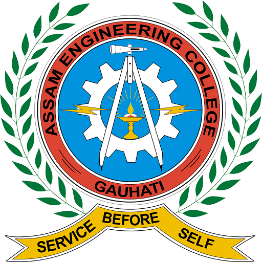
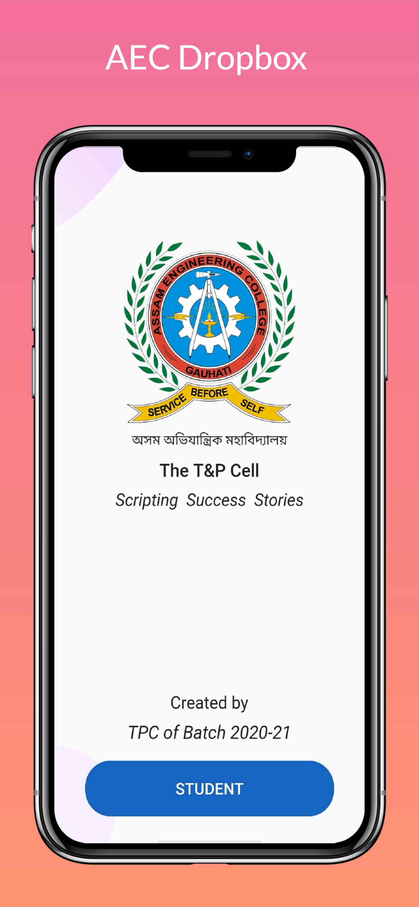
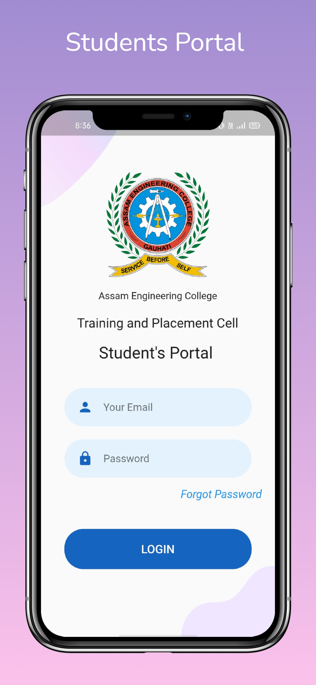

# AEC Dropbox

It is an official app of Assam Engineering College to carry placement activities in AEC smoothly and efficiently. It collects the academic, educational, and other necessary information that is being required at the campus interviews. It collects information like name, college roll nos, university roll nos, date of birth, academic performance along with other necessary information.It also facilitates the facility of editing some of the details if needed with proper permissions.

## Tech Stacks

- Flutter
- Firebase

## Screenshots

    

## Copyright

© copyright - Bhaskar Borah 2021
